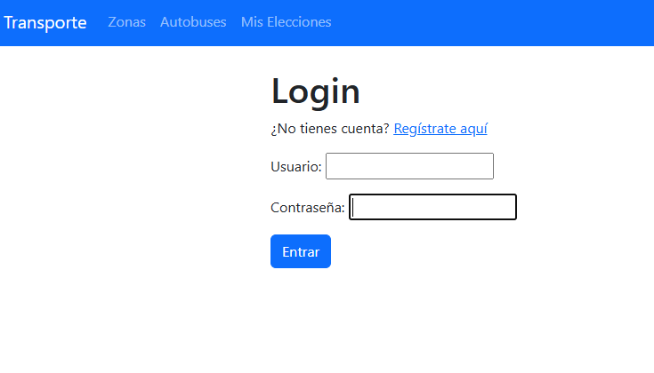
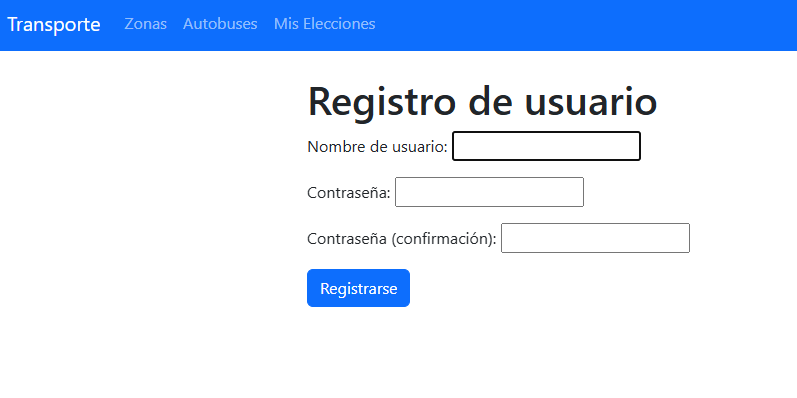
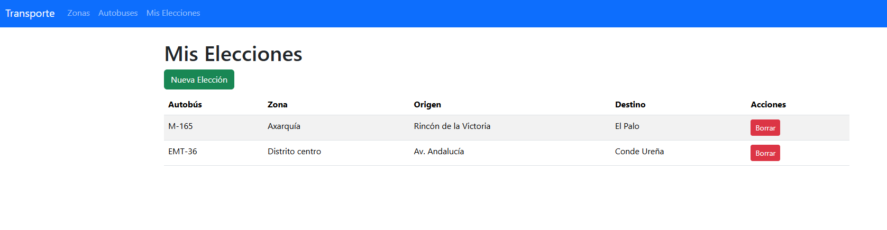
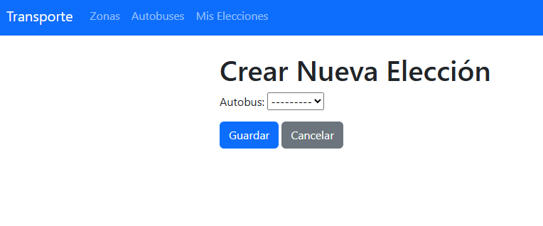

# Proyecto Django: Gestión de Rutas de Autobús

## Descripción
El proyecto consiste en en tres modelos (Autobús, Zona y Elección) que se suman al modelo base User para presentar a cada usuario nuevo que se registre distintas opciones de autobuses 
para que las pueda añadir en un CRUD sólo accesible desde su sesión (fuera del entorno admin). A continuación se presentarán algunas capturas del proceso de registro y creación de elecciones
propias, así como algunos fragmentos de código de los modelos. 

## Vista de login:
Pantalla a la que se redirige a cualquier usuario que carezca de token de sesión, si un usuario ya está registrado accede indicando su nombre de usuario y contraseña, si carece de cuenta
puede crear una registrándose.

## Vista de sign up:
Pantalla a la que se accede en caso de querer crear una nueva cuenta de usuario. Se pedirá nombre, contraseña y confirmación de esta. La contraseña debe contener 8 caracteres mínimo e intercalar
números y letras

## Vista de elecciones:
Esta es la primera vista a la que se accede tras haberte identificado o registrado. En caso de no tener ninguna elección todavía la tabla muestra un texto indicando la falta de datos de elección.
Desde esta misma vista se puede acceder a las secciones de zonas y autobuses para ver las opciones disponibles. Esto se hace mediante una barra de navegación heredada del archivo Templates/base.html mediante
templates de django.

## Vista de creación de elecciones:
En esta vista aparece un menú desplegable que accede a todos los autobuses disponibles para que al pulsar sobre uno y sobre el botón guardar se añada a la lista personal de elecciones

